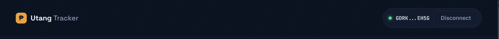
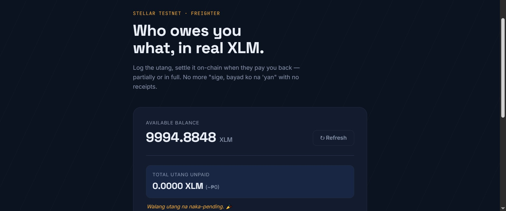
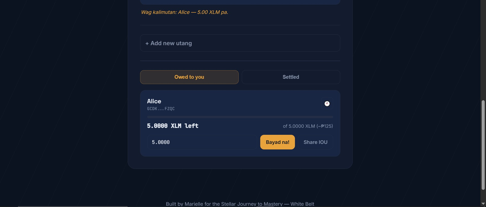
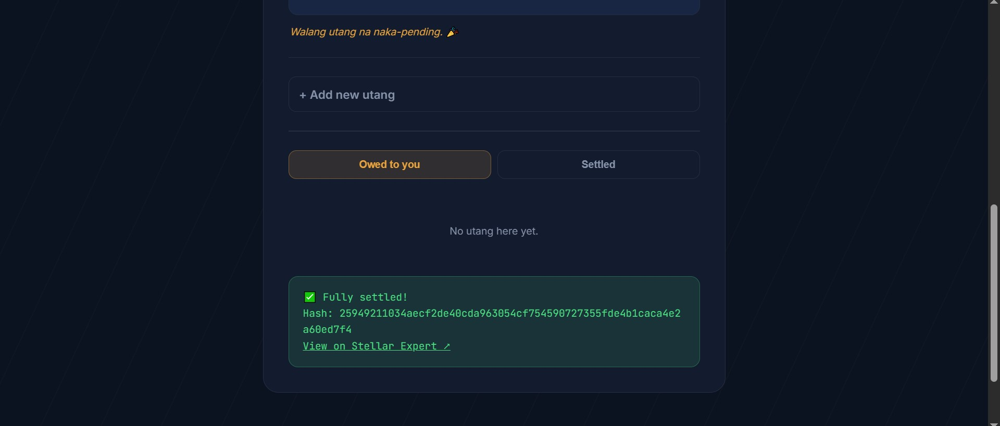

# Utang Tracker 🇵🇭

A debt-tracking dApp built for **Stellar Journey to Mastery — White Belt (Level 1)**.

Log who owes you what, settle it (fully or partially) with a real XLM payment on Stellar Testnet, and keep a history of every payment — no more "sige, babayaran ko na yan" with no receipts.

## Features

**Core (Level 1 requirements)**
- Connect / disconnect a Freighter wallet
- Fetch and display the connected wallet's XLM balance
- Send an XLM payment on Testnet
- Live feedback: pending → success (with tx hash + explorer link) or failure (with error message)

**Utang-specific features**
- 📋 **Debt list with names** — log each person, their wallet address, and how much they owe, saved locally so it persists between visits
- 🗂️ **Owed to you / Settled tabs** — debts move to "Settled" automatically once fully paid
- 💱 **XLM ↔ PHP display** — every amount is shown in XLM and an approximate peso value
- ✅ **"Bayad na!" button** — settle a debt (fully or partially) with one click, confetti fires when a debt is fully cleared
- 📊 **Running utang total** — header stat showing total unpaid across everyone, live-updating
- 💬 **Rotating nudge captions** — friendly rotating reminders about who still owes what
- 🔗 **Shareable IOU link + QR code** — generate a link/QR for any debt that the debtor can open to pay you directly, no need to type your address
- 🧩 **Partial payments** — settle a debt in installments; the remaining balance and progress bar update automatically
- 🕘 **Per-person payment history** — expand any debt to see every past payment, each linking to Stellar Expert

## Tech stack

- Plain HTML / CSS / JavaScript — no framework, no build step
- [`@stellar/freighter-api`](https://www.npmjs.com/package/@stellar/freighter-api) — wallet connection & signing
- [`@stellar/stellar-sdk`](https://www.npmjs.com/package/@stellar/stellar-sdk) — building & submitting transactions
- Both loaded from [esm.sh](https://esm.sh) as ES modules — nothing to install
- [QR Server API](https://goqr.me/api/) for generating IOU QR codes
- Debts are stored in the browser's `localStorage` (client-side only, no backend)

## Prerequisites

- [Freighter wallet](https://www.freighter.app) installed as a browser extension
- Freighter set to **Testnet** (Settings → Network)
- A funded Testnet account — fund one for free at [https://friendbot.stellar.org](https://friendbot.stellar.org)

## How to run locally

This uses ES modules, so it needs to be served over `http://`, not opened directly as a `file://` path.

With Python:
```bash
cd utang-tracker
python -m http.server 8000
```
Then open **http://localhost:8000**.

Or with Node.js:
```bash
npx serve .
```

## How to use

1. **Connect wallet** and approve in Freighter
2. Click **+ Add new utang** — enter a name, their wallet address, and how much they owe
3. When they pay you back, click **Bayad na!** on their card (adjust the amount for a partial payment) and approve the transaction in Freighter
4. Watch the progress bar and remaining balance update; once fully paid, the card moves to the **Settled** tab
5. Click **Share IOU** on any debt to get a link/QR code the debtor can open to pay you directly
6. Click the 🕘 icon on any debt to see its full payment history

## Notes

- **PHP conversion** uses a fixed approximate rate (`1 XLM ≈ ₱25`) defined at the top of `app.js` — swap it for a live rate API if you want real-time accuracy.
- **"Disconnect"** clears this app's local session only — Freighter doesn't expose a way for a dapp to revoke its own connection; that permission lives in the extension itself.
- **Data storage**: debts are saved in your browser's `localStorage`, tied to this browser/device — they won't sync across devices or follow a specific wallet if you switch accounts.

## Screenshots

**Wallet connected state:**


**Balance displayed:**


**Adding a new utang (with the rotating nudge caption):**


**Successful testnet transaction + result shown to user:**


## License

MIT
